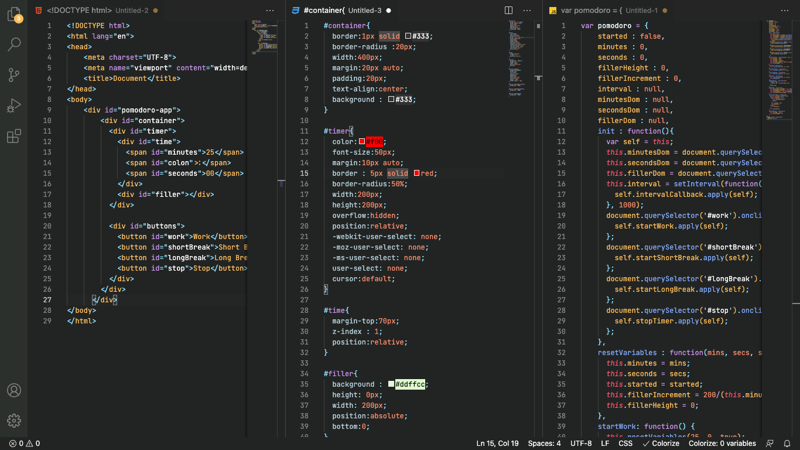

<h1 align="center">Welcome to Vilarezz Theme 👋</h1>

  
  
  
  
  
  

> Experimental theme based on Vilarezz colors.

### 🏠 [Homepage](https://github.com/vilarezz/vilarezz-theme.git)

## Prerequisites

- vscode ^1.52.0

## Install

Install it from VS Code extensions.

>Open VS Code extensions and type `Vilarezz Theme`.

## Author

👤 **Gil Vilarezz**

* Website: gitshowcase.com/vilarezz
* Twitter: [@vilarezz](https://twitter.com/vilarezz)
* Github: [@vilarezz](https://github.com/vilarezz)
* LinkedIn: [@vilarezz](https://linkedin.com/in/vilarezz)

## Show your support

Give a ⭐️ if this project helped you!

## 📝 License

Copyright © 2021 [Gil Vilarezz](https://github.com/vilarezz). 
This project is [MIT](https://github.com/vilarezz/vilarezz-theme/blob/main/LICENSE) licensed.

***
_This README was generated with ❤️ by [readme-md-generator](https://github.com/kefranabg/readme-md-generator)_